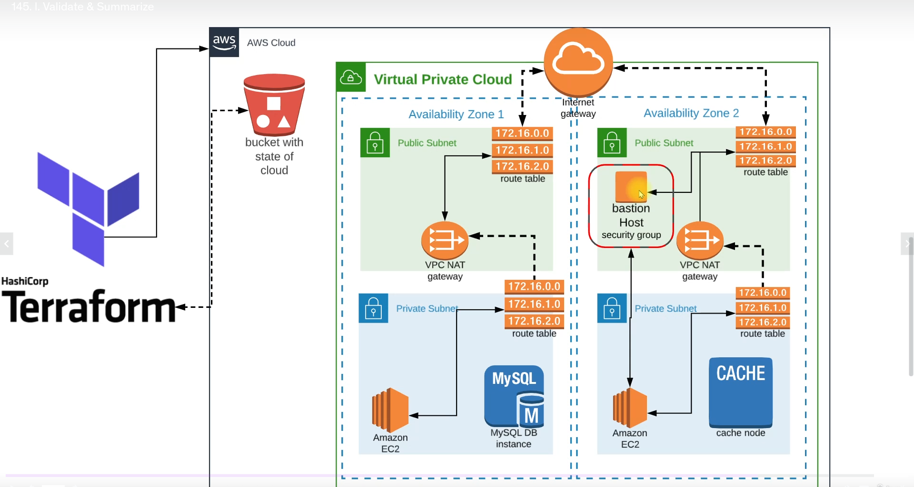
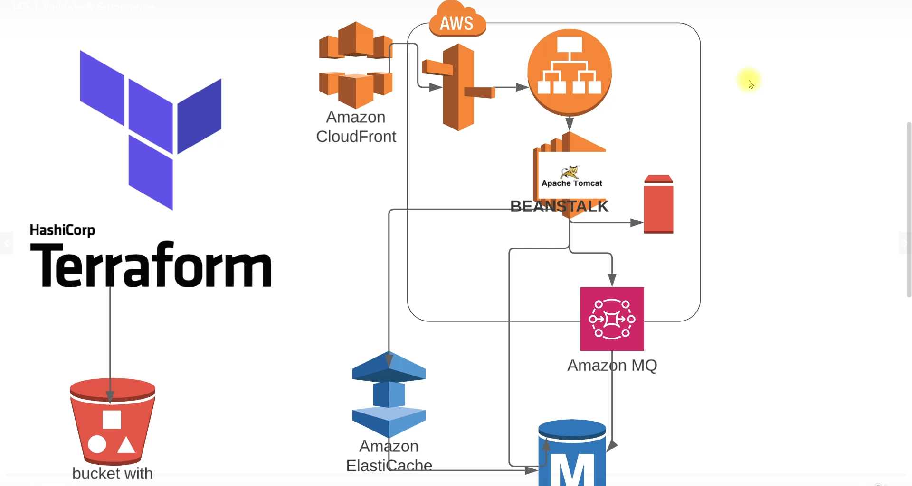
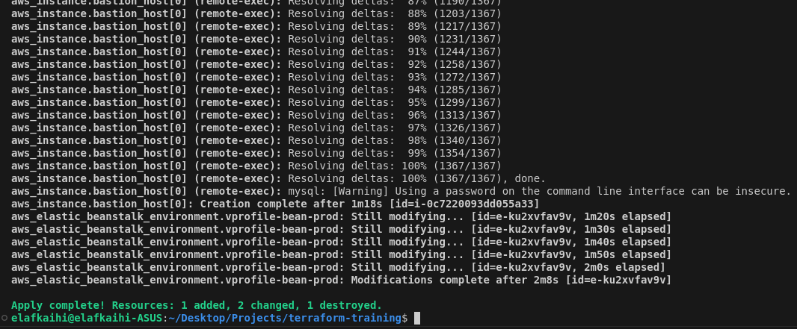

# Terraform Training Project

This project is designed to enhance my skills in Terraform by working with various Terraform providers, resources, templates, modules, and artifacts.

## Table of Contents
- [Project Overview](#project-overview)
- [Infrastructure Architecture](#infrastructure-architecture)
- [AWS Services Architecture](#aws-services-architecture)
- [Expected Outputs](#expected-outputs)
- [Installation](#installation)
- [Usage](#usage)
- [Contributing](#contributing)

## Project Overview
This repository contains code and configurations to practice and improve my Terraform skills. The project involves creating and managing infrastructure using Terraform, focusing on providers, resources, templates, modules, and artifacts.

## Infrastructure Architecture

The infrastructure architecture diagram outlines the overall structure and relationships of the components deployed by Terraform.

## AWS Services Architecture

This diagram details the specific AWS services used in the project, showing how they interact and are configured.

## Expected Outputs
### Terraform Success Result

This image shows the successful output from Terraform, indicating that the infrastructure has been deployed correctly.

### Login Page

This image represents the login page that is part of the deployed infrastructure, serving as an indicator of successful application deployment.

## Installation
To get started with this project, follow these steps:

1. **Clone the repository**
   ```bash
   git clone https://github.com/elafkaihi/terraform-training.git
   cd terraform-training
   ```

2. **Install Terraform**
   Make sure you have Terraform installed. You can download it from [Terraform's official website](https://www.terraform.io/downloads.html).

3. **Initialize Terraform**
   Initialize the Terraform configuration by running:
   ```bash
   terraform init
   ```

## Usage
To deploy the infrastructure, follow these steps:

1. **Plan the deployment**
   Generate and review the execution plan by running:
   ```bash
   terraform plan
   ```

2. **Apply the configuration**
   Apply the Terraform configuration to create the infrastructure:
   ```bash
   terraform apply
   ```

3. **Destroy the infrastructure**
   To remove the deployed infrastructure, run:
   ```bash
   terraform destroy
   ```

## Contributing
Contributions are welcome! Please follow these steps to contribute:

1. Fork the repository.
2. Create a new branch: `git checkout -b feature-branch`
3. Make your changes and commit them: `git commit -m 'Add some feature'`
4. Push to the branch: `git push origin feature-branch`
5. Open a pull request.


